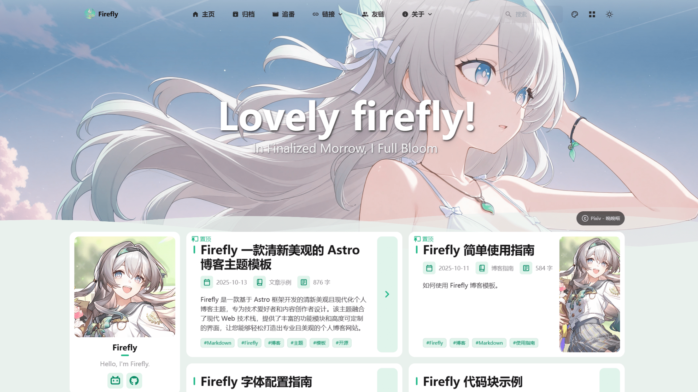
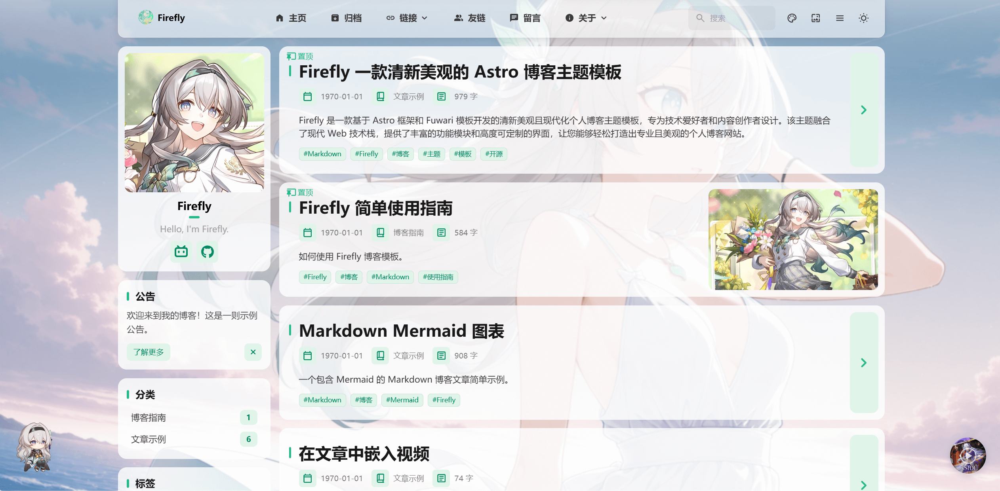

<div align="center">

# Firefly
> 一款清新美观的 Astro 博客主题模板
</div>


---

[**🖥️在线预览**](https://firefly.cuteleaf.cn/) /
[**📝使用文档**](https://docs-firefly.cuteleaf.cn/) /
[**🍀我的博客**](https://blog.cuteleaf.cn) 

⚡ 静态站点生成: 基于Astro的超快加载速度和SEO优化

🎨 现代化设计: 简洁美观的界面，支持自定义主题色

📱 移动友好: 完美的响应式体验，移动端专项优化

🌟 看板娘支持: 同时支持Spine和Live2D动画引擎

🔧 高度可配置: 大部分功能模块均可通过配置文件自定义



<table>
  <tr>
    <td valign="top"></td>
    <td valign="top"></td>
  </tr>
 </table>

## ✨ 功能特性

### 核心功能

- [x] **Astro + Tailwind CSS** - 基于现代技术栈的超快静态站点生成
- [x] **流畅动画** - Swup 页面过渡动画，提供丝滑的浏览体验
- [x] **响应式设计** - 完美适配桌面端、平板和移动设备
- [x] **多语言支持** - i18n 国际化，支持简体中文、繁体中文、英文、日文、俄语
- [x] **全文搜索** - 基于 Pagefind 的客户端搜索，支持文章内容索引。同时支持 MeiliSearch 搜索引擎

### 个性化

- [x] **主题色自定义** - 360° 色相调节，支持亮色/暗色/跟随系统三种模式
- [x] **壁纸模式切换** - 横幅壁纸、全屏壁纸、纯色背景，前台一键切换
- [x] **布局切换** - 列表/网格布局，前台自由切换
- [x] **字体管理** - 支持自定义字体，丰富的字体选择器
- [x] **樱花特效** - 可配置数量的樱花飘落动画
- [x] **文章随机封面图** - 支持通过 API 获取随机封面图，多 API 重试机制，失败自动使用备用图片

### 页面组件

- [x] **文章目录** - 自动生成，支持桌面端和移动端
- [x] **侧边栏配置** - 可关闭/切换左右位置，丰富的侧边栏组件
- [x] **导航栏定制** - Logo、标题、链接全面自定义
- [x] **友情链接** - 精美的友链展示卡片
- [x] **留言板** - 支持留言页面，集成评论系统
- [x] **赞助页面** - 多种支付方式、收款码展示、赞助者列表、文章内赞助按钮
- [x] **公告栏** - 顶部公告提示，支持关闭和自定义样式
- [x] **页脚配置** - HTML 内容注入，完全自定义
- [x] **关于页面** - 自定义个人介绍

### 媒体功能

- [x] **音乐播放器** - 基于 APlayer，支持本地音乐和 Meting API 在线音乐
- [x] **看板娘** - 支持 Spine 和 Live2D 两种动画引擎
- [x] **追番页** - 基于 Bangumi API 的追番记录展示

### 交互功能

- [x] **评论系统** - 集成 Twikoo、Waline、Giscus、Disqus 评论系统
- [x] **访问量统计** - 支持调用Waline，Twikoo自带的访问量追踪
- [x] **增强代码块** - 基于 Expressive Code，支持代码折叠、行号、语言标识
- [x] **数学公式支持** - KaTeX 渲染引擎，支持行内和块级公式
- [x] **图片灯箱** - Fancybox 图片预览功能
- [x] **RSS 订阅** - 自动生成 RSS Feed
- [x] **站点地图** - 自动生成 XML Sitemap，支持页面过滤配置

### 性能优化

- [x] **图片优化** - Astro Image 自动处理
- [x] **代码分割** - 自动按需加载
- [x] **SEO 优化** - 完整的 meta 标签和结构化数据
- [x] **懒加载** - 图片和组件按需加载
- [x] **站点地图优化** - 自动生成 sitemap-index.xml 和多级站点地图

## 📝计划中...

- [ ] **重构 Live2D 看板娘**
- [ ] **修复追番页加载数据问题**
- [ ] 更多功能持续完善中...

如果你有好用的功能和优化，请提交 [Pull Request](https://github.com/CuteLeaf/Firefly/pulls)

## 🚀 快速开始

### 环境要求

- Node.js ≤ 22
- pnpm ≤ 9

### 本地开发部署

1. **克隆仓库：**
   ```bash
   git clone https://github.com/Cuteleaf/Firefly.git
   cd Firefly
   ```
   **先 [Fork](https://github.com/CuteLeaf/Firefly/fork) 到自己仓库在克隆（推荐）**
   ```bash
   git clone https://github.com/you-github-name/Firefly.git
   cd Firefly
   ```
3. **安装依赖：**
   ```bash
   # 如果没有安装 pnpm，先安装
   npm install -g pnpm
   
   # 安装项目依赖
   pnpm install
   ```

4. **配置博客：**
   - 编辑 `src/config/` 目录下的配置文件自定义博客设置
   - 修改 `astro.config.mjs` 中的 `site` 配置为你的实际部署域名地址，用于生成正确的 sitemap，RSS feed和SEO meta
 
   ```javascript
   export default defineConfig({
   	site: "https://your-domain.com/",  // 修改为你的实际域名
   	// ... 其他配置
   });
   ```
5. **启动开发服务器：**
   ```bash
   pnpm dev
   ```
   博客将在 `http://localhost:4321` 可用

### 平台托管部署
- **参考[官方指南](https://docs.astro.build/zh-cn/guides/deploy/)将博客部署至 Vercel, Netlify, GitHub Pages, Cloudflare Pages, EdgeOne Pages 等。**

## 📖 配置说明

> 📚 **详细配置文档**: 查看 [Firefly使用文档](https://docs-firefly.cuteleaf.cn/) 获取完整的配置指南

### 配置文件结构

```
src/
├── config/
│   ├── index.ts              # 配置索引文件
│   ├── siteConfig.ts         # 站点基础配置
│   ├── profileConfig.ts      # 用户资料配置
│   ├── commentConfig.ts      # 评论系统配置
│   ├── announcementConfig.ts # 公告配置
│   ├── licenseConfig.ts      # 许可证配置
│   ├── footerConfig.ts       # 页脚配置
│   ├── FooterConfig.html     # 页脚HTML内容
│   ├── expressiveCodeConfig.ts # 代码高亮配置
│   ├── sakuraConfig.ts       # 樱花特效配置
│   ├── fontConfig.ts         # 字体配置
│   ├── sidebarConfig.ts      # 侧边栏布局配置
│   ├── navBarConfig.ts       # 导航栏配置
│   ├── musicConfig.ts        # 音乐播放器配置
│   ├── pioConfig.ts          # 看板娘配置
│   ├── adConfig.ts           # 广告配置
│   ├── friendsConfig.ts      # 友链配置
│   ├── sponsorConfig.ts      # 赞助配置
│   └── coverImageConfig.ts  # 文章随机封面图配置
```


## ⚙️ 文章 Frontmatter

```yaml
---
title: My First Blog Post
published: 2023-09-09
description: This is the first post of my new Astro blog.
image: ./cover.jpg  # 或使用 "api" 来启用随机封面图
tags: [Foo, Bar]
category: Front-end
draft: false
lang: zh-CN      # 仅当文章语言与 `siteConfig.ts` 中的网站语言不同时需要设置
---
```

## 🧞 指令

下列指令均需要在项目根目录执行：

| Command                           | Action                            |
|:----------------------------------|:----------------------------------|
| `pnpm install` 并 `pnpm add sharp` | 安装依赖                              |
| `pnpm dev`                        | 在 `localhost:4321` 启动本地开发服务器      |
| `pnpm build`                      | 构建网站至 `./dist/`                   |
| `pnpm preview`                    | 本地预览已构建的网站                        |
| `pnpm new-post <filename>`        | 创建新文章                             |
| `pnpm astro ...`                  | 执行 `astro add`, `astro check` 等指令 |
| `pnpm astro --help`               | 显示 Astro CLI 帮助                   |

## 💝 赞助

如果 Firefly 对你有帮助，欢迎通过以下方式赞助支持项目的发展：

<table>
  <tr>
    <td align="center">
      <strong>支付宝</strong><br/>
      
    </td>
    <td align="center">
      <strong>微信</strong><br/>
      
    </td>
    <td align="center">
      <strong>爱发电</strong><br/>
      
    </td>
  </tr>
</table>

## 🙏 致谢

- 感谢原始 [Fuwari](https://github.com/saicaca/fuwari) 模板
- 感谢基于Fuwari二次开发的[Mizuki](https://github.com/matsuzaka-yuki/Mizuki) 模板
- 感谢b站up[公公的日常](https://space.bilibili.com/3546750017080050)提供的Q版 流萤 看板娘切片数据模型
- 使用 [Astro](https://astro.build) 和 [Tailwind CSS](https://tailwindcss.com) 构建
- 图标来自 [Iconify](https://iconify.design/)

## 🍀 贡献者

感谢以下贡献者对本项目做出的贡献，如有问题或建议，请提交 [Issue](https://github.com/CuteLeaf/Firefly/issues) 或 [Pull Request](https://github.com/CuteLeaf/Firefly/pulls)。

<a href="https://github.com/CuteLeaf/Firefly/graphs/contributors">
  
</a>


## ⭐ Star History

[](https://star-history.com/#CuteLeaf/Firefly&Date)


<!-- ALL-CONTRIBUTORS-LIST:START - Do not remove or modify this section -->
<!-- prettier-ignore-start -->
<!-- markdownlint-disable -->

<!-- markdownlint-restore -->
<!-- prettier-ignore-end -->

<!-- ALL-CONTRIBUTORS-LIST:END -->
